# Manuscript Publication Sequence Diagram

This document illustrates the detailed sequence of interactions between all participants in the manuscript submission, review, and publication process.

## Sequence Diagram

```mermaid
sequenceDiagram
    participant A as Author
    participant JS as Journal System
    participant EIC as Editor-in-Chief
    participant AE as Associate Editor
    participant R1 as Reviewer 1
    participant R2 as Reviewer 2
    participant R3 as Reviewer 3 (if needed)
    participant CE as Copy Editor
    participant TP as Typesetter/Production
    participant DB as Indexing Databases
    
    Note over A,DB: SUBMISSION PHASE
    A->>JS: Submit manuscript with cover letter
    JS->>A: Submission confirmation
    JS->>EIC: Notify of new submission
    
    Note over EIC: Administrative & scope check
    EIC->>JS: Review submission
    
    alt Desk Reject
        EIC->>JS: Desk reject decision
        JS->>A: Rejection notification
    else Proceed to Review
        EIC->>AE: Assign to Associate Editor
        AE->>JS: Accept assignment
        
        Note over A,DB: REVIEWER SELECTION PHASE
        AE->>JS: Search for potential reviewers
        AE->>R1: Invitation to review
        AE->>R2: Invitation to review
        
        alt Reviewer Declines
            R1->>AE: Decline invitation
            AE->>JS: Find alternative reviewer
        else Reviewer Accepts
            R1->>AE: Accept invitation
            R2->>AE: Accept invitation
        end
        
        Note over A,DB: PEER REVIEW PHASE
        AE->>R1: Send manuscript
        AE->>R2: Send manuscript
        
        Note over R1: Review period (2-4 weeks)
        Note over R2: Review period (2-4 weeks)
        
        R1->>JS: Submit review & recommendation
        R2->>JS: Submit review & recommendation
        
        alt Reviews Conflict
            JS->>AE: Alert to conflicting reviews
            AE->>R3: Invite third reviewer
            R3->>AE: Accept invitation
            AE->>R3: Send manuscript
            Note over R3: Review period (2-4 weeks)
            R3->>JS: Submit review
        end
        
        Note over A,DB: EDITORIAL DECISION PHASE
        JS->>AE: Compile all reviews
        AE->>JS: Make recommendation
        AE->>EIC: Forward recommendation
        
        EIC->>JS: Make final decision
        
        alt Major Revisions Required
            JS->>A: Decision letter with reviewer comments
            Note over A: Revision period (typically 2-3 months)
            A->>JS: Submit revised manuscript + response letter
            JS->>AE: Notify of resubmission
            AE->>R1: Send revised manuscript
            AE->>R2: Send revised manuscript
            
            Note over R1,R2: Re-review period
            R1->>JS: Submit re-review
            R2->>JS: Submit re-review
            AE->>EIC: Make recommendation
            EIC->>JS: Make decision
        else Minor Revisions Required
            JS->>A: Decision letter with comments
            Note over A: Revision period (typically 2-4 weeks)
            A->>JS: Submit revised manuscript + response letter
            JS->>AE: Notify of resubmission
            AE->>EIC: Review changes
            EIC->>JS: Verify revisions adequate
        else Reject
            JS->>A: Rejection letter
        end
        
        Note over A,DB: ACCEPTANCE & PRODUCTION PHASE
        alt Manuscript Accepted
            JS->>A: Acceptance letter
            JS->>A: Copyright/license agreement
            A->>JS: Sign and return agreement
            
            JS->>CE: Send accepted manuscript
            Note over CE: Copy editing (1-2 weeks)
            CE->>JS: Return edited manuscript
            
            JS->>A: Send edited version for review
            A->>JS: Approve edits or request changes
            
            alt Changes Requested
                JS->>CE: Implement author changes
                CE->>JS: Return corrected version
                JS->>A: Send for approval
                A->>JS: Approve
            end
            
            JS->>TP: Send for typesetting
            Note over TP: Create formatted proofs (1 week)
            TP->>JS: Generate proofs (PDF)
            
            JS->>A: Send proofs for review
            Note over A: Proof review (48-72 hours)
            A->>JS: Return corrections or approval
            
            alt Corrections Needed
                JS->>TP: Implement corrections
                TP->>JS: Generate corrected proofs
                JS->>A: Send for final approval
                A->>JS: Approve
            end
            
            Note over A,DB: PUBLICATION PHASE
            TP->>JS: Final production approval
            JS->>JS: Assign DOI
            JS->>A: Notify of DOI assignment
            
            JS->>JS: Online First publication
            JS->>A: Notify article is live
            
            JS->>JS: Schedule for journal issue
            JS->>JS: Publish in final issue
            
            Note over A,DB: POST-PUBLICATION PHASE
            JS->>DB: Submit metadata for indexing
            DB->>DB: Index in PubMed, Web of Science, etc.
            DB->>JS: Confirm indexing
            
            JS->>A: Final publication notification
            JS->>JS: Begin tracking citations & metrics
        end
    end
```

## Participants

### Primary Stakeholders
- **Author**: Researcher submitting the manuscript
- **Journal System**: Automated platform managing the workflow
- **Editor-in-Chief (EIC)**: Final decision maker, oversees entire process
- **Associate Editor (AE)**: Subject matter expert, manages peer review
- **Reviewers (R1, R2, R3)**: Peer experts evaluating manuscript quality

### Production Team
- **Copy Editor (CE)**: Improves language, style, and clarity
- **Typesetter/Production (TP)**: Creates formatted, publication-ready version
- **Indexing Databases (DB)**: External services (PubMed, Web of Science, etc.)

## Process Phases

### 1. Submission Phase
**Timeline**: Immediate
- Author submits manuscript through the journal system
- System sends automated confirmation to author
- Editor-in-Chief is notified of new submission
- Initial administrative and scope verification

**Possible Outcomes**:
- Desk rejection (out of scope, poor quality, formatting issues)
- Proceed to peer review

### 2. Reviewer Selection Phase
**Timeline**: 1-2 weeks
- Associate Editor identifies qualified reviewers
- Invitations sent to potential reviewers
- System handles acceptances/declinations
- Alternative reviewers sought if needed

**Key Challenges**:
- Reviewer availability
- Finding appropriate expertise
- Avoiding conflicts of interest

### 3. Peer Review Phase
**Timeline**: 2-4 weeks per review round
- Manuscript distributed to accepted reviewers
- Reviewers conduct independent evaluation
- Reviews and recommendations submitted to system
- Third reviewer engaged if reviews conflict

**Review Components**:
- Scientific merit and methodology
- Originality and significance
- Clarity and presentation
- Recommendation (Accept/Minor Revisions/Major Revisions/Reject)

### 4. Editorial Decision Phase
**Timeline**: 1-2 weeks
- Associate Editor synthesizes reviewer feedback
- Recommendation forwarded to Editor-in-Chief
- Final editorial decision made

**Possible Decisions**:
- **Accept**: Ready for production
- **Minor Revisions**: Small changes needed (2-4 weeks revision period)
- **Major Revisions**: Substantial changes required (2-3 months revision period)
- **Reject**: Not suitable for publication

### 5. Revision Cycle (if applicable)
**Timeline**: Varies by revision type

**Minor Revisions**:
- Author submits revised manuscript with response letter
- Associate Editor/EIC reviews changes
- Decision: Accept or request additional revisions

**Major Revisions**:
- Author substantially revises manuscript
- Re-submitted to original reviewers
- Full re-review process
- May require multiple revision rounds

### 6. Acceptance & Production Phase
**Timeline**: 3-6 weeks

**Copy Editing** (1-2 weeks):
- Language and style improvements
- Author review and approval
- Iterative corrections if needed

**Typesetting** (1 week):
- Format manuscript to journal standards
- Generate PDF proofs
- Author review (48-72 hours)
- Final corrections implemented

### 7. Publication Phase
**Timeline**: Varies by journal schedule
- DOI (Digital Object Identifier) assigned
- Online First/Early View publication
- Scheduled for specific journal issue
- Final publication in complete issue

### 8. Post-Publication Phase
**Timeline**: Ongoing
- Metadata submitted to indexing databases
- Article indexed in PubMed, Web of Science, Scopus, etc.
- Citation and usage metrics tracking begins
- Long-term accessibility and discoverability

## Key Timeframes

| Phase | Typical Duration |
|-------|------------------|
| Initial Editorial Review | 1-2 weeks |
| Reviewer Selection | 1-2 weeks |
| Peer Review | 2-4 weeks per reviewer |
| Editorial Decision | 1-2 weeks |
| Minor Revisions | 2-4 weeks |
| Major Revisions | 2-3 months |
| Copy Editing | 1-2 weeks |
| Typesetting & Proofing | 1 week |
| Online First Publication | Immediate after approval |
| Issue Publication | Per journal schedule |
| Database Indexing | 1-4 weeks post-publication |

**Total Timeline**: 
- Fast track (no revisions): 2-3 months
- With minor revisions: 3-4 months
- With major revisions: 6-9 months

## Communication Points

### Automated System Notifications
- Submission confirmation
- Reviewer invitation responses
- Review submission alerts
- Decision notifications
- Revision deadlines
- Production milestones
- Publication alerts

### Human-to-Human Interactions
- Editor-Author correspondence
- Reviewer-Editor discussions
- Editorial board consultations
- Author-Production team exchanges

## Quality Control Checkpoints

1. **Administrative Check**: Completeness and formatting
2. **Scope Verification**: Journal fit assessment
3. **Peer Review**: Scientific quality evaluation
4. **Revision Adequacy**: Response to reviewer comments
5. **Copy Edit Review**: Author approval of edits
6. **Proof Review**: Final accuracy verification
7. **Pre-Publication Check**: Metadata and DOI verification

## Related Documentation
- [MANUSCRIPT_WORKFLOW.md](MANUSCRIPT_WORKFLOW.md) - Workflow Flowchart
- [PRD.md](PRD.md) - Product Requirements Document
- [USER_WORKFLOWS.md](USER_WORKFLOWS.md) - User Workflows
- [roles.md](roles.md) - System Roles and Permissions
