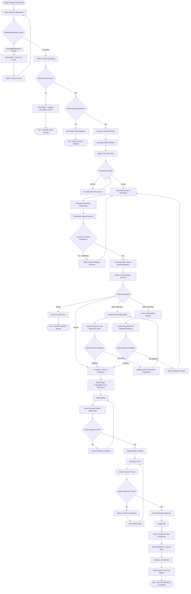

# Manuscript Submission and Publication Workflow

This document outlines the complete workflow for manuscript submission, peer review, and publication in the journal management system.

## Workflow Diagram

## Workflow Stages

### 1. Submission Stage
- **Author Prepares Manuscript**: Initial preparation of research article
- **Author Submits Manuscript**: Formal submission to the journal
- **Initial Administrative Check**: Verification of formatting and completeness

### 2. Editorial Screening
- **Editor-in-Chief Screening**: Initial quality and scope assessment
- **Desk Rejection Points**: Early rejection for out-of-scope or low-quality submissions
- **Associate Editor Assignment**: Assignment to subject-matter expert

### 3. Peer Review Stage
- **Reviewer Selection**: Associate editor identifies qualified reviewers
- **Peer Review Process**: Expert evaluation of the manuscript
- **Review Consolidation**: Editor synthesizes reviewer feedback

### 4. Editorial Decision
- **Accept**: Manuscript accepted without changes
- **Minor Revisions**: Small improvements required
- **Major Revisions**: Substantial changes needed
- **Reject**: Manuscript not suitable for publication

### 5. Revision Cycle
- **Author Response**: Authors address reviewer comments
- **Re-evaluation**: Editor or reviewers assess changes
- **Iterative Process**: May require multiple revision rounds

### 6. Production Stage
- **Copyright/License Agreement**: Legal documentation
- **Copy Editing**: Language and style improvements
- **Typesetting**: Final formatting and layout
- **Proofing**: Final author verification

### 7. Publication
- **DOI Assignment**: Permanent identifier creation
- **Online First**: Early online publication
- **Issue Publication**: Inclusion in journal issue
- **Indexing**: Addition to academic databases
- **Metrics Tracking**: Citation and usage monitoring

## Key Decision Points

1. **Administrative Check**: Ensures submission meets basic requirements
2. **Scope & Quality Check**: Prevents unsuitable manuscripts from entering review
3. **Reviewer Availability**: Ensures qualified peer review
4. **Review Consensus**: Validates editorial decisions
5. **Revision Adequacy**: Confirms author responses are sufficient
6. **Production Approval**: Verifies accuracy before publication

## Related Documentation
- [PRD.md](PRD.md) - Product Requirements Document
- [USER_WORKFLOWS.md](USER_WORKFLOWS.md) - User Workflows
- [roles.md](roles.md) - System Roles
